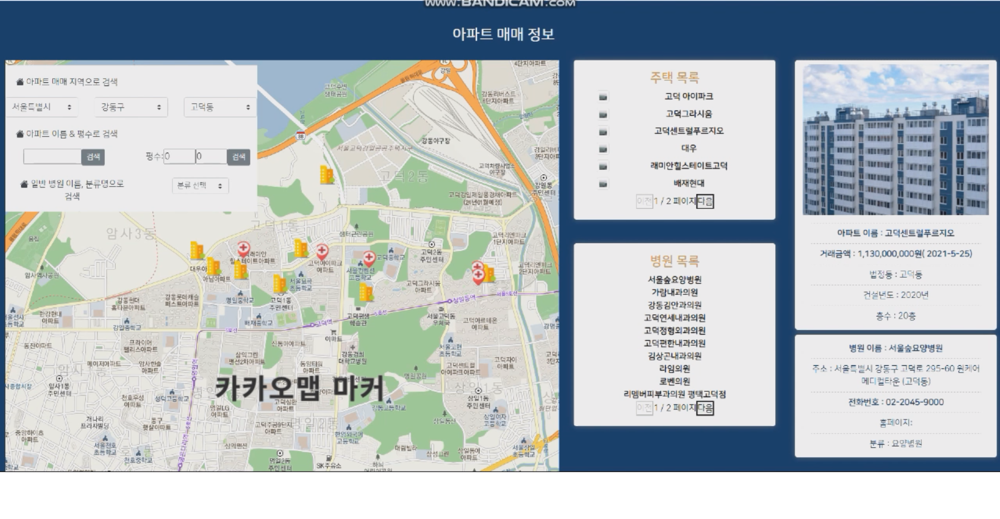

# 🏘️ HappyHouse - 부동산 실거래가 조회 웹사이트

> **공공 데이터를 활용한 실거래가 기반 부동산 정보 제공 서비스**  
> 회원 기능, 커뮤니티, 지도 기반 거래정보, 병원 정보까지 통합 제공


---

## ✨ 주요 기능

### 👤 회원 기능
- 회원가입 / 로그인 / 로그아웃
- 회원 정보 수정 및 탈퇴
- **관리자 전용 기능**
  - 전체 회원 조회 / 삭제
  - 게시글 수정 / 삭제
  - 공지사항 작성 및 관리

### 📝 커뮤니티 게시판 (Q&A & 공지사항)
- 질문 게시글 작성 / 수정 / 삭제
- 답변 채택 기능
- 추천 기능
- 관리자 전용 공지 작성
- 공지 상세 페이지 조회수 기록

### 📍 아파트 실거래가 조회
- **검색 기능**
  - 법정동 또는 아파트 이름으로 검색 가능
  - 평수 검색 시 구별 평균 거래가격 및 거래 횟수 통계 제공
  - 신도시 구·군별 평균 거래 내역 표시

- **카카오 맵 연동**
  - 검색 지역 기반 지도 이동
  - 거래 마커 표시 및 상세 정보 확인  
    → 아파트 이름, 거래금액, 거래일시, 사진, 법정동, 건설년도, 층수

- **주변 병원 정보 제공**
  - 병원 목록 표시 및 마커 등록
  - 병원 클릭 시 상세 정보 제공  
    → 병원명, 주소, 전화번호, 홈페이지, 분류

---

## ⚙️ 사용 기술

| 분야 | 기술 스택 |
|------|-----------|
| Backend | Java, Spring Boot, JPA |
| Frontend | Thymeleaf, HTML, CSS, Bootstrap |
| DB | MySQL |
| API | Kakao Map API, 공공데이터포털 (CSV 기반) |
| 기타 | Spring Security, 서버 세션 기반 로그인 관리 |

---

## 📁 프로젝트 구조 (예시)

```
HappyHouse/
├── src/
│   ├── controller/
│   ├── service/
│   ├── repository/
│   ├── model/
│   └── templates/
├── static/
├── images/
├── data/
└── README.md
```

---

## 📊 시연 이미지

| 지도 검색 | 아파트 정보 | 병원 정보 |
|-----------|--------------|-------------|
|   |

---

## 👥 팀원 (SSAFY 7기)

- 김주희 
- 오철환

---

## 🔧 향후 개선 사항

- 거래 정보 수집 방식을 기존의 CSV 수동 수집에서 공공데이터 API를 활용한 자동화 방식으로 전환하여 최신 실거래가를 지속적으로 반영할 수 있도록 개선
- 검색 자동완성 및 추천 기능
- OAuth 기반 소셜 로그인 연동
- Elasticsearch 기반 고속 검색 기능

---
